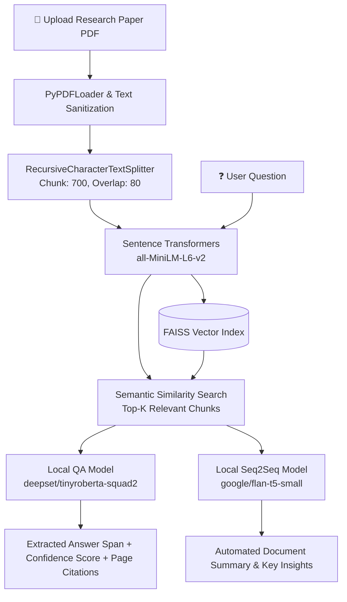

# 📚 Research Paper Q&A Assistant (Local RAG)

A privacy-focused, 100% offline **Retrieval-Augmented Generation (RAG)** application for exploring, querying, and summarizing research papers and academic PDF documents without relying on external cloud APIs or paid LLM services.

---

## 🌟 Key Features

- **🔒 100% Local & Privacy-Preserving:** Operates entirely on consumer hardware with local CPU inference. No external API keys (OpenAI, Anthropic, etc.) required, ensuring sensitive documents remain private.
- **📄 Robust PDF Parsing & Chunking:** Uses LangChain's `PyPDFLoader` with null-byte sanitization and `RecursiveCharacterTextSplitter` (700-character chunks with 80-character overlap) for optimal context preservation.
- **⚡ High-Performance Vector Retrieval:** Embeds document chunks into a dense 384-dimensional semantic space via `sentence-transformers/all-MiniLM-L6-v2` and indexes them using a **FAISS** vector store for sub-second similarity search.
- **🎯 Dual-Model Local Inference Engine:**
  - **Extractive QA:** Employs `deepset/tinyroberta-squad2` (~81.5M parameters) for fast, extractive question answering with exact span localization, confidence scoring, and source page citations.
  - **Generative Seq2Seq:** Utilizes `google/flan-t5-small` for abstractive multi-page summarization and key insight synthesis.
- **💻 CPU & Memory Optimized:** Tailored for Windows/CPU execution with fine-grained PyTorch thread capping and BLAS/MKL thread isolation to eliminate CPU throttling.
- **🖥️ Multi-View Streamlit UI:** Features 5 organized tabs:
  1. **Q&A Engine:** Ask questions, view extracted answer spans, confidence scores, and inspect retrieved context chunks with page numbers.
  2. **Document Chunks:** Inspect chunk distributions and text segmentation.
  3. **Research Paper Summary:** One-click abstractive summary generation.
  4. **Key Insights:** Extract core findings and takeaways.
  5. **Extracted Document Text:** Inspect page-by-page extracted raw text.

---

## 🏗️ Architecture & Pipeline



---

## 🚀 Getting Started

### 1. Prerequisites
- Python 3.9 - 3.11 recommended.

### 2. Installation
Clone the repository and install the dependencies:
```bash
pip install -r requirements.txt
```

### 3. Run the Application
Launch the Streamlit web dashboard:
```bash
streamlit run app.py
```

---

## 🛠️ Tech Stack

- **Framework & UI:** [Streamlit](https://streamlit.io/)
- **RAG & Orchestration:** [LangChain](https://www.langchain.com/) (`langchain-community`, `langchain-text-splitters`, `langchain-huggingface`)
- **Embeddings:** `sentence-transformers/all-MiniLM-L6-v2`
- **Vector Database:** [FAISS](https://github.com/facebookresearch/faiss) (CPU edition)
- **Deep Learning & Models:** PyTorch, Hugging Face `transformers` (`deepset/tinyroberta-squad2`, `google/flan-t5-small`)
- **Document Ingestion:** `pypdf`, `tempfile`

---

## 📜 License
MIT License
